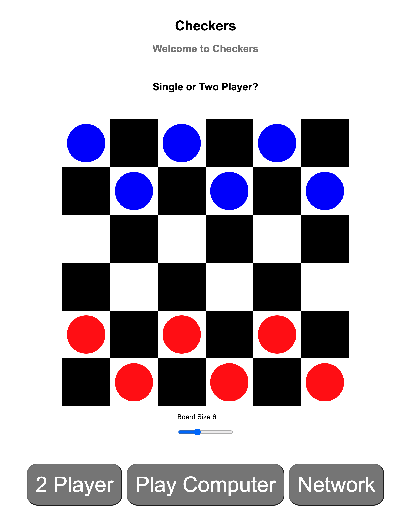

# checkers
Wireframe

MVP
- place peices
- move peice
- adding/removing peices
- calculate winner

Technology Used
- JavaScript, HTML, CSS
- WebSocket
- WebRTC

Game Link
- [Checkers](https://kenneychan.github.io/network-checkers/)

Stretch
- variable size board
- 1 player mode
- 2 player on differnt browsers 

Rules used
- https://www.hasbro.com/common/instruct/Checkers.PDF

WebSocket server used
- https://levelup.gitconnected.com/create-a-simple-local-web-chat-application-with-websocket-f92130619ab7

WebRTC used
- https://www.youtube.com/watch?v=FExZvpVvYxA

Next Steps
- Deploy WebSocket server to https://www.heroku.com/

